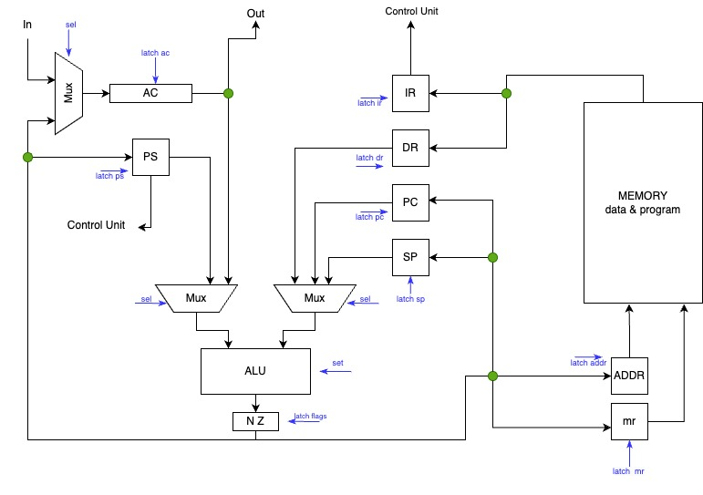
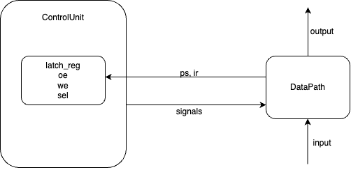

# csa-lab

Автор: Ри Аркадий Русланович, P33081

**Исходный вариант:**
```
lisp | acc | neum | mc | tick | struct | stream | port | pstr | prob2 | 8bit 
```
**Упрощенный вариант:**
```
asm | acc | neum | hw | instr | struct | stream | port | pstr | prob2 
```

## Язык программирования
```ebnf
<program> ::= <asm_line> | <asm_line> <program> 
<asm_line> ::= <label> ":" <command> |
               <label> ":" <adr_command> <addres> |
               <command> |
               <command> <operand> |
               <adr_command> <operand> |
               <label> ":" <operand> |
               <data_definition> |
               <empty string>
<data_defenition> :: = ".word" <operand> | .word 'positive_number'  ',' <string>
<label> ::= <letter> | <letter> <label>
<operand> ::= <address> | <label>
<string> ::= <letter> | <letter> <string> 
<letter> ::= any symbols 
<addres> ::= <number> | <number> <addres>
<number> ::= any number
```

### Дополнительное описание
Все что не является пустой строкой - это:
- Комментарий (начинается на ;)
- Определение адреса (специальное слово org)
- Директива ('<command>')
  - адресная 
  - безадресная (команда и операнд через пробел)
- Метка ('<label>')
- Определение данных (начинается с ключевого слова .word)

### Семантика
- Видимость данных -- глобальная 
- Поддерживаются целочисленные литерылы (без ограничений на размер)
- Код выполняются последовательно
- Название метки:
   - не начинается с цифры
   - не совпадает с ключевыми словами и именами команд
- Точку входа определяется меткой _start
- Любой текст после символа ; считается комментарием 
- Пробельные символы в начале и конце строки игнорируются 
- Поддерживаются строковые литералы, оформляются по типу `.word 5, 'hello'` (перед ',' указывается размер строки)

## Устройство памяти 

Список регистров:

 - AC -- акумулятор (результат всех операций, подключение к портам IO)
 - ADDR -- адрес для записи в память 
 - PC -- счетчик команд (адрес следующей инструкции)
 - IR -- регистр инструкций (текущая инструкция)
 - SP -- указатель на стек 
 - DR -- регистр данных (данные для выполнения операций)
 - mr -- данные для записи в память
 - PS -- состояние программы (N, Z флаги)

```text

            Instruction & Data memory
+-----------------------------------------------+
|    0    :  jmp _start                         |  
|        ...                                    |
| _start  :  program start                      |
|        ...                                    |
|        ...                                    |
+-----------------------------------------------+
```
- Память данных и команд общая 
- Виды адресации:
  - абсолютная 
  - косвенная
- Размер машинного слова и размер памяти не определен
- Адрес 0 -- переход к началу программы


## Система команд

Особенности процессора:

- Длина машинного слова не определена (знаковое)
- В качестве аргументов команды принимают адреса 

| Инструкция         | Кол-во тактов*| Описание                                                                         |
|:-------------------|:--------------|:---------------------------------------------------------------------------------|
| inc                | 1             | увеличить значение в аккумуляторе на 1                                           |
| dec                | 1             | уменьшить значение в аккумуляторе на 1                                           |
| hlt                | 0             | остановить работу программы                                                      |
| push               | 2             | записать значение аккумулятора на стеке                                          |
| pop                | 3             | получить значение со стека в аккумулятор                                         |
| nop                | 1             | отсутствие операции                                                              |
| jg `<addr>`        | 1             | перейти по адресу, если флаг N == 0                                              |
| jz `<addr>`        | 1             | перейти по адресу, если флаг Z == 0                                              |
| jnz `<addr>`       | 1             | перейти по адресу, если флаг Z != 0                                              |
| jmp `<addr>`       | 1             | переход по адресу                                                                |
| ld `<addr>`        | 2-4           | загрузить значение в аккумулятор                                                 |
| st `<addr>`        | 2-4           | сохранить значение аккумулятора по адресу                                        |
| add `<addr>`       | 2-4           | сложить с аккумулятором значение по адресу и записать в аккумулятор              |
| cmp `<addr>`       | 2-4           | вычесть из аккумулятора значение по адресу и установить флаги                    |
| and `<addr>`       | 2-4           | выполнить битовое "И" над аккумулятором и значением по адресу и установить флаги |
| out `<addr>`       | 2-4           | напечатать значение аккумулятора в порт по адресу                                |
| in `<addr>`        | 1-3           | записать в аккумулятор значение с порта ввода по адресу                          |

- (*) -- без этапа выборки инструкции (она всегда проходит за 2 такта)
- `<addr>` -- абсолютная/косвенная адресация

### Кодирование инструкций

- Машинный код сереализуется в список JSON
- Один элемент списка - одна инструкция/константа

Пример: 
```json
  {"index": 0, 
  "opcode": "JMP", 
  "value": 11, 
  "is_indirect": false
  }
```
* пояснения: *
- index -- адрес в памяти
- opcode -- код команды 
- value -- операнд
- is_indirect -- вид адресации (true - косвенная, false - абсолютная)

## Транслятор 

Интерфейс командной строки [translator.py](./translator.py) `<input_file> <target_file>`

Транслятор работает за несколько проходов, каждый из которых вынесен в отдельный метод:
  -`find_org` -- поиск метки `org` и установление адреса начала заполнения памяти
  - `clean` -- форматирование исходного кода: отчистка строк от комментариев и пробельных символов 
  - `stage_1` -- разделение кода на токены: на метки и не метки (команды, константы, операнды)
  - `stage_2` -- подстановка адресов на место меток
  - `stage_3` -- сереализация в JSON
Любая неизвестная информация определяется как `NOP`

## Модель процессора

Интерфейс командной строки [machine.py](./machine.py) `<machine_code> <input_file>`  

### DataPath



Имена регистров на схеме соотвествуют именам в модели

Сигналы: 
- latch_address -- защелкнуть адрес 
- latch_mr --  защелкнуть регистр для записи в память
- latch_instr -- защелкнуть регистр инструкций 
- latch_dr -- защелкнуть регистр данных
- latch_pc -- защелкнуть счетчик команд 
- latch_sp -- защелкнуть указатель стека
- latch_flags -- защелкнуть флаги
- latch_acc -- защелкнуть аккумулятор
- alu_execution -- выполнение операции в алу

Флаги:
- N -- результат в АЛУ меньше 0
- Z -- результат в АЛУ равен 0

### ControlUnit



Реализация в классе ControlUnit

- основной метод `run_fetches` моделирует выполнение полного цикла инструкций:
  - `instruction_fetch`
  - `abstract_execution` содержащий в себе подстановку адресов и непосредственно выполнение команд
- после выполнения команд производится логирование, отображающие состояние регистров системы

Особенности реализации модели:

- Цикл симуляции осуществляется в функции `simulation`
- Шаг равен одной инструкции, после ее выполнения в журнал происходит запись состояния регистров
- Для логирования журнала состояний используется `logging`
- При запуске модели ограничено количество инструкций выполнения а также количество ячеек памяти
- Остновка моделирования происходит когда:
  - превышен лимит выполненных инструкций 
  - выполнена команда hlt реализована в исключения `ExitExceptionError` 
  - выброшены исключения: `wrong_mux`, `unkown_operation`

## Тестирование

Реализованы следующие алгоритмы:
  - [hello_world](./examples/src/hello.asm) -- вывод 'Hello, World!'
  - [cat](./examples/src/cat.asm) -- имитация cat (ввод повторяем в вывод)
  - [hello_user](./examples/src/hello_user.asm) -- запрос у пользователя ввода и вывод в формате `Hello, <input>`
  - [prob2](./examples/src/prob2.asm) -- алгоритм по варианту

Также реализованы golden тесты в папке [golden](./golden)
  
